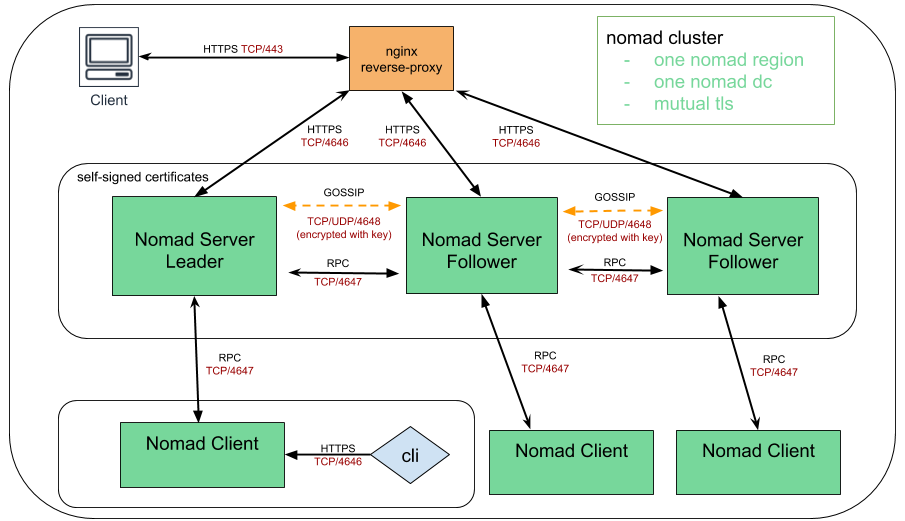

# Run Nomad cluster on AWS with terraform in single DC and in single nomad region

## High Level Overview



## Prerequisites

- git
- terraform
- own or control the registered domain name for the certificate 
- have a DNS record that associates your domain name and your server’s public IP address
- Cloudflare subscription as it is used to manage DNS records automatically
- AWS subscription
- ssh key
- Debian based AMI

## How to run

- Get the repo

```
git clone https://github.com/achuchulev/terraform-aws-nomad-1dc-1region.git
cd terraform-aws-nomad-1dc-1region
```

- Create `terraform.tfvars` file

```
# AWS vars
access_key = "your_aws_access_key"
secret_key = "your_aws_secret_key"
ami = "some_aws_ami_id" # Debian based AMI like Ubuntu Xenial or Bionic	
instance_type = "ec2-instance-instance-type"
public_key = "your_public_ssh_key"
region = "aws-region"
availability_zone = "aws-availability-zone"
subnet_id = "subnet_id"
vpc_security_group_ids = ["security-group/s-id/s"]

# Cloudflare vars
cloudflare_email = "you@email.com"
cloudflare_token = "your-cloudflare-token"
cloudflare_zone = "your.domain" # example: nomadlab.com
subdomain_name = "subdomain_name" # example: lab

# Nomad vars
nomad_version = "some-nomad-version"
servers_count = "number-of-nomad-server" # defaults to 3
clients_count = "number-of-nomad-clients" # defaults to 3
instance_role = "client" # used by client module
datacenter = "some-nomad-dc" # specifies nomad dc
nomad_region = "some-nomad-region" # specifies nomad region
```


```
Note: Security group in AWS should allow https on port 443.
```

- Initialize terraform

```
terraform init
```

- Deploy nginx and nomad instances

```
terraform plan
terraform apply
```

- `Terraform apply` will:
  - create new instances on AWS for server/client/frontend
  - copy nomad and nginx configuration files
  - install nomad
  - install cfssl (Cloudflare's PKI and TLS toolkit)
  - generate the selfsigned certificates for Nomad cluster 
  - install nginx
  - configure nginx reverse proxy
  - install certbot
  - automatically enable HTTPS on website with EFF's Certbot, deploying Let's Encrypt certificate
  - check for certificate expiration and automatically renew Let’s Encrypt certificate
  - start nomad server and client
  
## Access Nomad

#### via CLI

for example:

```
$ nomad node status
$ nomad server members
```

```
Note

Nomad CLI defaults to communicating via HTTP instead of HTTPS. As Nomad CLI also searches 
environment variables for default values, the process can be simplified exporting environment 
variables like shown below which is done by the provisioning script:

$ export NOMAD_ADDR=https://your.dns.name
```

#### via WEB UI console

Open web browser, access nomad web console using your instance dns name as URL and verify that 
connection is secured and SSL certificate is valid  

### Run nomad job

#### via UI

- go to `jobs`
- click on `Run job`
- paste or author HCL or JSON to submit to your cluster. A plan will be requested before the job is submitted
- run `Plan`
- review `Job Plan` and `Run` it


#### via CLI

```
$ nomad job run [options] <job file>
```
